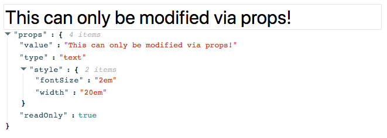

# props-editor

```
npm install --save props-editor
```

`props-editor` is a React component that is either a handy development tool, an affront to React, neither of these things, or possibly both at the same time. `props-editor` is a component that you wrap another component with. This child component will then be given a JSON editing UI to modify its `props` with.

```jsx
import React from 'react';
import ReactDOM from 'react-dom';

import PropsEditor from '../src/index.js';

ReactDOM.render(
  <PropsEditor>
    <input
      value="This can only be modified via props!"
      type="text"
      style={{ fontSize: '2em', width: '20em' }}
      readOnly
    />
  </PropsEditor>,
  document.getElementById('app')
);
```

[](https://jeremyckahn.github.io/props-editor/)

## Why?

Sometimes during development, it is handy to directly modify the `props` of a React component to see how it responds. This component provides a way to achieve that.

## Why not React DevTools?

Most of the time, React DevTools are a better solution for this need. This tool was created for situations where React DevTools are either unavailable or impractical. For example, if you'd like to stand up an internal demo of a project to share with folks who are not engineers, it may be more effective to provide a props editing UI in the application itself, rather than instructing them how to install React RevTools and modify the props that way.

## Running tests (written in Mocha)

Code should be tested!  [Mocha](https://mochajs.org/) is a perennial test framework among JavaScript developers, so this project uses that and [Enzyme](http://airbnb.io/enzyme/).

```
# run tests in the CLI
npm test
```

```
# run tests in the CLI with a watcher that will re-run tests
# when you make a code change
npm run test:watch
```

You can also run the test suite in browsers via [Karma](https://karma-runner.github.io).  Only Chrome and Firefox are configured by default because other browsers are a little hard to get to run consistently.  Running the tests in IE are supported and known to work, but are disabled by default.  Please see the note in `karma.conf.js` in the `browsers` section if you would like instructions on how to run the tests in IE.

```
npm run test:browsers
```

## Debugging

This project configures Webpack to generate [source maps](https://www.html5rocks.com/en/tutorials/developertools/sourcemaps/) so you can use your browser's dev tools to debug your ES6 code just as easily as you would with ES5.

```
# run the tests in your browser
npm start
```

From here, you can fire up your browser's dev tools and set breakpoints, step through code, etc.  You can run the app at <a href="http://localhost:9123">http://localhost:9123</a>, or run the tests at <a href="http://localhost:9123/test/">http://localhost:9123/test/</a>.

## A build process

All projects need a build process, and this project leverages Webpack for that as well.

```
npm run build
```

Your compiled code will wind up in the `dist` directory.

## Documentation

You should make sure to update the [JSDoc](http://usejsdoc.org/) annotations as you work.  To view the formatted documentation in your browser:

```
npm run doc
npm run doc:view
```

This will generate the docs and run them in your browser.  If you would like this to update automatically as you work, run this task:

```
npm run doc:live
```

## Versioned releases

npm makes it super easy to make versioned releases!  This project is set up to run tests before making a release, which helps prevent you from releasing new versions with bugs.  This happens automatically thanks to the [npm version scripts](https://docs.npmjs.com/cli/version).

```
npm version patch # Or "minor," or "major"
```

This will also use the [gh-pages](https://github.com/tschaub/gh-pages) utility to deploy your versioned project with [GitHub Pages](https://pages.github.com/).

## License

MIT.
